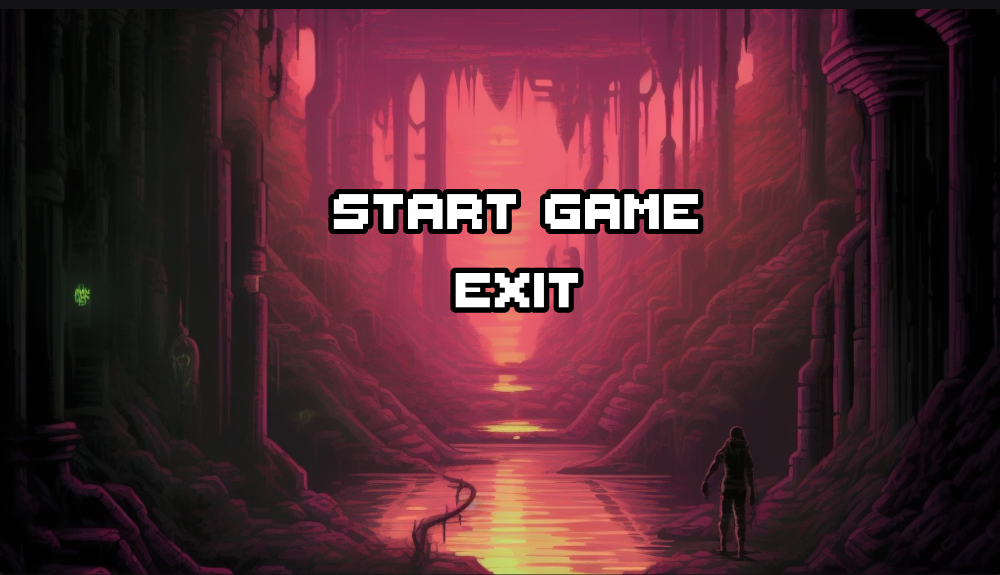
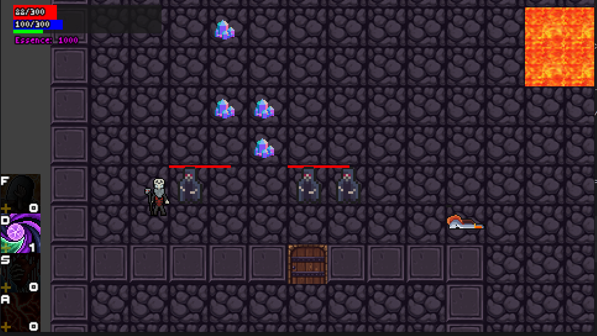

Мой самый большой проект был посвящен изучению ООП. Сейчас, глядя на реализацию и зависимости классов, я понимаю, что многое можно было бы улучшить. Тем не менее, в целом все получилось неплохо.

В этом проекте я познакомился с юнит-тестированием, освоил принцип MVC и научился документировать код.

Также у меня есть версия игры, где все обрабатывается в многопоточном режиме. Если интересно, я могу её показать.

Цель игры — добраться до последнего этажа. На пути к нему будут встречаться монстры.

У игрока есть скиллы — это расширяемый класс, поэтому добавлять новые умения легко.

Мобы бывают големами, нежитью и живыми, это тоже расширяемый класс.

Големы оставляют после смерти лаву, эссенцию или камень в зависимости от типа голема.

Нежить после смерти просто исчезает.

Живых, после их смерти, персонаж может изучить и поднять, чтобы они воевали за него.

Карта состоит из лавы, стен, пола, дверей и лестниц, с которыми можно взаимодействовать.

Убивая монстров, герой прокачивается и может улучшать свои скиллы за очки опыта.

Вот пример игры:

Это старт

Пример игры:

